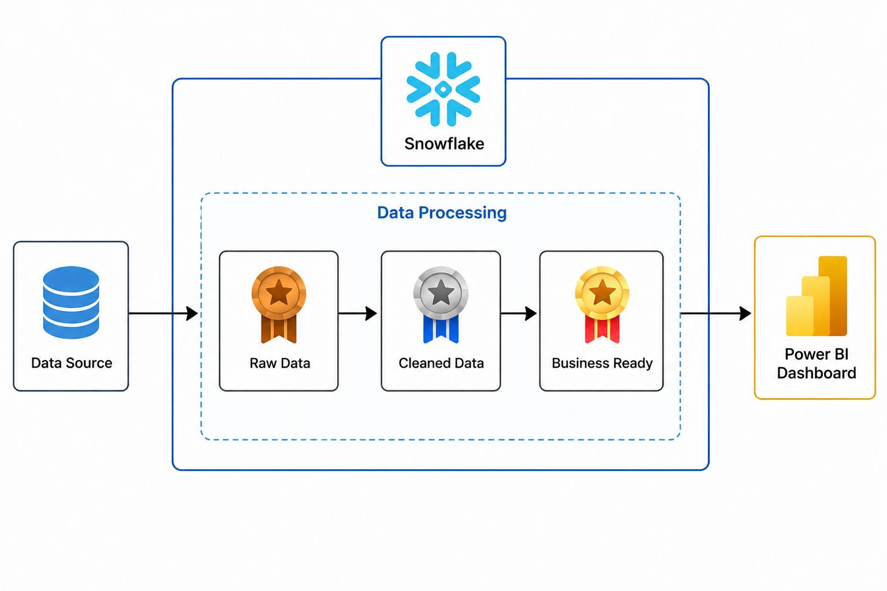
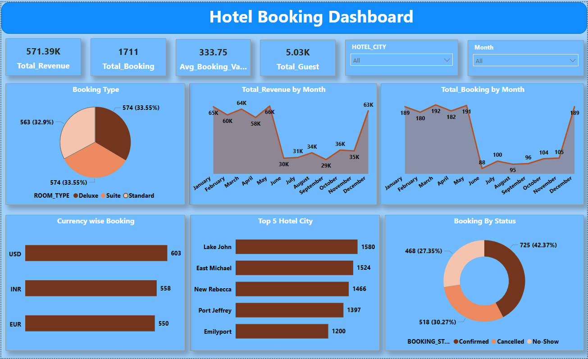

# Snowflake Hotel Analytics

## Project Overview
This repository contains a Snowflake-based hotel analytics pipeline that ingests raw hotel booking data, processes it through multiple layers, and delivers business-ready insights to a Power BI dashboard.

## Architecture
The solution follows a layered data processing architecture:

1. **Data Source**
   - The raw hotel bookings dataset is the starting point for the pipeline.

2. **Raw Data**
   - Data is ingested into the Bronze layer, preserving the original source content for traceability.

3. **Cleaned Data**
   - The Silver layer transforms and cleans raw records to ensure data quality and consistency.

4. **Business Ready**
   - The Gold layer produces analytics-ready data optimized for reporting and business use.

5. **Power BI Dashboard**
   - Final business-ready data is consumed by a Power BI dashboard for visualization and decision support.

## Repository Structure

- `Architecture Diagram/`
  - Contains the solution architecture diagram.

- `Dashboard/`
  - Contains the Power BI dashboard files and related artifacts.

- `Data Processing files/`
  - `setup.sql` - setup of Snowflake objects or initial environment.
  - `Bronze_Layer.sql` - ingestion and raw data staging logic.
  - `Silver_Layer.sql` - data cleaning and transformation logic.
  - `Gold_Layer.sql` - business-ready model creation logic.

- `Data Set/`
  - `hotel_bookings_raw.csv` - the source dataset used for the analytics pipeline.

- `Image/`
  - `Dashboard_Preview.png` - screenshot of the Power BI dashboard.

## Getting Started

1. Load `hotel_bookings_raw.csv` into Snowflake as the source dataset.
2. Run `setup.sql` to create required schemas, tables, and any initial configuration.
3. Execute `Bronze_Layer.sql` to stage raw data in the Bronze layer.
4. Execute `Silver_Layer.sql` to clean and normalize the data.
5. Execute `Gold_Layer.sql` to generate business-ready datasets for reporting.
6. Open the Power BI dashboard in the `Dashboard/` folder and connect it to the Snowflake Gold layer.

## Notes

- The architecture is designed for clear separation of concerns between raw ingestion, data cleaning, and business reporting.
- Snowflake serves as the central data platform for storage and transformation.
- Power BI is used for consuming and visualizing the final business-ready layer.

## Dashboard Overview

The Power BI dashboard displays hotel booking metrics and trends from the business-ready Gold layer.

Key dashboard components:

- KPI tiles for `Total_Revenue`, `Total_Booking`, `Avg_Booking_Value`, and `Total_Guest`
- Filters for `HOTEL_CITY` and `Month`
- `Booking Type` pie chart showing room type distribution for Deluxe, Suite, and Standard
- `Total_Revenue by Month` trend chart
- `Total_Booking by Month` trend chart
- `Currency wise Booking` chart for USD, INR, and EUR
- `Top 5 Hotel City` bar chart for the highest-booking destinations
- `Booking By Status` donut chart showing Confirmed, Cancelled, and No-Show counts